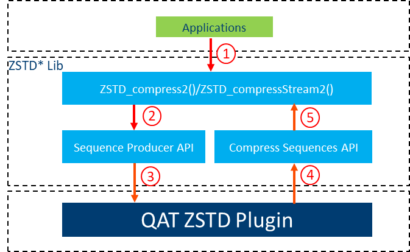

# Intel&reg; QuickAssist Technology ZSTD Plugin (QAT ZSTD Plugin)

## Table of Contents

- [Introduction](#introduction)
- [Licensing](#licensing)
- [Hardware Requirements](#hardware-requirements)
- [Software Requirements](#software-requirements)
- [Limitations](#limitations)
- [Installation Instructions](#installation-instructions)
- [Legal](#legal)

## Introduction

Intel&reg; QuickAssist Technology ZSTD Plugin (QAT ZSTD Plugin) is a plugin to Zstandard*(ZSTD*) for accelerating compression by QAT. ZSTD* is a fast lossless compression algorithm, targeting real-time compression scenarios at zlib-level and better compression ratios. ZSTD* provides block-level sequence producer API which allows users to register their custom sequence producer that libzstd invokes to process each block from [1.5.4][1]. The produced list of sequences (literals and matches) is then post-processed by libzstd to produce valid compressed blocks.

Intel® QuickAssist Technology (Intel® QAT) provides cryptographic and compression acceleration capabilities used to improve performance and efficiency across the data center. QAT sequence producer will offload the process of producing block-level sequences of L1-L12 compression to Intel® QAT, and get performance gain.

<p align=center>

</p>

## Licensing

The Licensing of the files within this project is split as follows:

Intel&reg; QuickAssist Technology ZSTD Plugin - BSD License. Please see the `LICENSE` file contained in the top level folder. Further details can be found in the file headers of the relevant files.

## Hardware Requirements

Intel® 4xxx (Intel® QuickAssist Technology Gen 4)

## Software Requirements

ZSTD* library of version 1.5.4+

[Intel® QAT Driver for Linux* Hardware v2.0][2] or [Intel® QuickAssist Technology Library (QATlib)][3] of version 22.07.0+

## Limitations

 1. Supports compression levels L1 to L12
 2. ZSTD* sequence producer only supports ZSTD* compression API which respects advanced parameters, such as `ZSTD_compress2`, `ZSTD_compressStream2`.
 3. The ZSTD_c_enableLongDistanceMatching cParam is not currently supported. Compression will fail if it is enabled and tries to compress with QAT sequence producer.
 4. Dictionaries are not currently supported. Compression will succeed if the dictionary is referenced, but the dictionary will have no effect.
 5. Stream history is not currently supported. All advanced ZSTD* compression APIs, including streaming APIs, work with QAT sequence producer, but each block is treated as an independent chunk without history from previous blocks.
 6. Multi-threading within a single compression is not currently supported. In other words, compression will fail if `ZSTD_c_nbWorkers` > 0 and an external sequence producer is registered. Multi-threading across compressions is fine: simply create one CCtx per thread.

For more details about ZSTD* sequence producer, please refer to [zstd.h][4].

## Installation Instructions

### Build and install Intel® QuickAssist Technology Driver

Users can choose [Intel® QAT Driver for Linux* Hardware v2.0][2](out-of-tree) or [Intel® QuickAssist Technology Library (QATlib)][3](in-tree) according to their requirements.

If using out-of-tree driver, the user needs to set `ICP_ROOT` environment variable:

`ICP_ROOT`: the root directory of the QAT driver source tree

#### Build and install Intel® QAT Driver for Linux* Hardware v2.0

Download from [Intel® QAT Driver for Linux* Hardware v2.0][2], follow the guidance: [Intel® QuickAssist Technology Software for Linux* - Getting Started Guide][5].

If installing the Intel® QAT 2.0 driver for use in a virtual environment, please refer to [Using Intel® Virtualization Technology (Intel® VT) with Intel® QuickAssist Technology][6]

After installing the QAT driver, please refer to [Intel® QuickAssist Technology Software for Linux* - Programmer's Guide][7] to the update QAT configuration file according to requirements.

QAT ZSTD Plugin needs a [SHIM] section by default.
There are two ways to change:
* QAT driver default conf file does not contain a [SHIM] section which the QAT ZSTD Plugin requires by default. You can add a [SHIM] section for QAT ZSTD Plugin.
* The default section name in the QAT ZSTD Plugin can be modified if required by setting the environment variable "QAT_SECTION_NAME".

After updating the configuration files, please restart QAT.

```bash
    service qat_service restart
```

#### Install QATlib

QATlib has been upstream to some platforms, RedHat, SUSE. Users also can install QATlib from source code according to [qatlib/INSTALL][8].

### Build QAT sequence producer library

Shared Virtual Memory (SVM) allows direct submission of an applications buffer, thus removing the memcpy cycle cost, cache thrashing, and memory bandwidth. The SVM feature enables passing virtual addresses to the QAT hardware for processing acceleration requests.

QAT sequence producer library runs on the SVM environment by default.

To enable SVM, please refer to [Using Intel® Virtualization Technology (Intel® VT) with Intel® QuickAssist Technology][6] to update the BIOS and [Intel® QuickAssist Technology Software for Linux* - Programmer's Guide][7] chapter 3.3 to update driver configuration.

```bash
    make
```

If ZSTD* 1.5.4 library is not installed, need to specify path to ZSTD* lib source root by compile variable "ZSTDLIB".

```bash
    make ZSTDLIB=[PATH TO ZSTD LIB SOURCE]
```

### Build QAT sequence producer library with USDM support

If SVM is not enabled, memory passed to Intel® QuickAssist Technology hardware must be DMA’able.

Intel provides a User Space DMA-able Memory (USDM) component (kernel driver and corresponding user space library) which allocates/frees DMA-able memory, mapped to user space, performs virtual to physical address translation on memory allocated by this library. Please refer to [Intel® QuickAssist Technology Software for Linux* - Programmer's Guide][7] chapter 3.3.

To enable USDM, please compile with "ENABLE_USDM_DRV=1".

```bash
    make ENABLE_USDM_DRV=1
```

### Build and run test program

```bash
    make test
    ./test/test [TEST FILENAME]
```

### Build and run benchmark tool

If SVM is not enabled, please compile with "ENABLE_USDM_DRV=1".

```bash
    make benchmark ENABLE_USDM_DRV=1
```

The `benchmark` is a tool used to perform QAT sequence producer performance tests, it supports the following options:

```bash
    -t#       Set maximum threads [1 - 128] (default: 1)
    -l#       Set iteration loops [1 - 1000000](default: 1)
    -c#       Set chunk size (default: 32K)
    -E#       Auto/enable/disable searchForExternalRepcodes(0: auto; 1: enable; 2: disable; default: auto)
    -L#       Set compression level [1 - 12] (default: 1)
    -m#       Benchmark mode, 0: software compression; 1:QAT compression(default: 1)
```

In order to get a better performance, increasing the number of threads with `-t` is a better way. The number of dc instances provided by Intel® QAT needs to be increased while increasing test threads, it can be increased by modifying the `NumberDcInstances` in `/etc/4xxx_devx.conf`. Note that the test threads number should not exceed the number of dc instances, as this ensures that each test thread can obtain a dc instance.
For more Intel® QAT configuration information, please refer to [Intel® QuickAssist Technology Software for Linux* - Programmer's Guide][7] chapter 5.
An example usage of benchmark tool with [Silesia compression corpus][9]:

```bash
   ./benchmark -m1 -l100 -c64K -t64 -E2 Silesia
```

which used the following Intel® QAT configuration file:

```bash
    # QAT configuration file /etc/4xxx_devx.conf
    ##############################################
    # User Process Instance Section
    ##############################################
    [SHIM]
    NumberCyInstances = 0
    NumberDcInstances = 64
    NumProcesses = 1
    LimitDevAccess = 0

    # Data Compression - User instance #0
    Dc1Name = "Dc0"
    Dc1IsPolled = 1
    # List of core affinities
    Dc1CoreAffinity = 0

    # Data Compression - User instance #1
    Dc2Name = "Dc1"
    Dc2IsPolled = 1
    # List of core affinities
    Dc2CoreAffinity = 1
    ...
    # Data Compression - User instance #63
    Dc63Name = "Dc63"
    Dc63IsPolled = 1
    # List of core affinities
    Dc63CoreAffinity = 63
```

### How to integrate QAT sequence producer into `zstd`
Integrating QAT sequence producer into the `zstd` command can speed up its compression, The following sample code shows how to enable QAT sequence producer by modifying the code of `FIO_compressZstdFrame` in `zstd/programs/fileio.c`.

Start QAT device and register qatSequenceProducer before starting compression job.

```c
    /* Start QAT device, start QAT device at any
    time before compression job started */
    QZSTD_startQatDevice();
    /* Create sequence producer state for QAT sequence producer */
    void *sequenceProducerState = QZSTD_createSeqProdState();
    /* register qatSequenceProducer */
    ZSTD_registerSequenceProducer(
        ress.cctx,
        sequenceProducerState,
        qatSequenceProducer
    );
    /* Enable sequence producer fallback */
    ZSTD_CCtx_setParameter(ress.cctx,, ZSTD_c_enableSeqProducerFallback, 1);
```

Stop QAT device after compression job

```c
    /* Free sequence producer state */
    QZSTD_freeSeqProdState(sequenceProducerState);
    /* Please call QZSTD_stopQatDevice before
    QAT is no longer used or the process exits */
    QZSTD_stopQatDevice();
```

Then recompile `zstd` with flag `-lqatseqprod`. Currently, only single-threaded mode compression is supported to using QAT sequence producer, please run `zstd` with the `--single-thread`.

Note : some parameters of `zstd` do not support sequence producer, for more zstd usage information please refer to [zstd manual][10].

```bash
    ./zstd --single-thread [TEST FILENAME]
```

### How to integrate QAT sequence producer into applications

**Initialization**

Start and initialize the QAT device.

Create sequence producer state for QAT sequence producer, then call `ZSTD_registerSequenceProducer` to register it in the application source code.

```c
    ZSTD_CCtx* const zc = ZSTD_createCCtx();
    /* Start QAT device, start QAT device at any
    time before compression job started */
    QZSTD_startQatDevice();
    /* Create sequence producer state for QAT sequence producer */
    void *sequenceProducerState = QZSTD_createSeqProdState();
    /* register qatSequenceProducer */
    ZSTD_registerSequenceProducer(
        zc,
        sequenceProducerState,
        qatSequenceProducer
    );
    /* Enable sequence producer fallback */
    ZSTD_CCtx_setParameter(zc, ZSTD_c_enableSeqProducerFallback, 1);
```

**Compression API**

No changes to the application with calling ZSTD* compression API, keep calling `ZSTD_compress2`, `ZSTD_compressStream2`, or `ZSTD_compressStream` to compress.

```c
    /* Compress */
    ZSTD_compress2(zc, dstBuffer, dstBufferSize, srcBuffer, srcbufferSize);
```

**Free resources and shutdown QAT device**

```c
    /* Free sequence producer state */
    QZSTD_freeSeqProdState(sequenceProducerState);
    /* Please call QZSTD_stopQatDevice before
    QAT is no longer used or the process exits */
    QZSTD_stopQatDevice();
```

Then link to libzstd and libqatseqprod like test program did.

## Legal

Intel&reg; disclaims all express and implied warranties, including without limitation, the implied warranties of merchantability, fitness for a particular purpose, and non-infringement, as well as any warranty arising from course of performance, course of dealing, or usage in trade.

This document contains information on products, services and/or processes in development.  All information provided here is subject to change without notice. Contact your Intel&reg; representative to obtain the latest forecast, schedule, specifications and roadmaps.

The products and services described may contain defects or errors known as errata which may cause deviations from published specifications. Current characterized errata are available on request.

Copies of documents which have an order number and are referenced in this document may be obtained by calling 1-800-548-4725 or by visiting www.intel.com/design/literature.htm.

Intel, the Intel logo are trademarks of Intel Corporation in the U.S. and/or other countries.

\*Other names and brands may be claimed as the property of others

[1]:https://github.com/facebook/zstd/releases/tag/v1.5.4
[2]:https://www.intel.com/content/www/us/en/download/765501.html
[3]:https://github.com/intel/qatlib
[4]:https://github.com/facebook/zstd/blob/dev/lib/zstd.h
[5]:https://www.intel.com/content/www/us/en/content-details/632506/intel-quickassist-technology-intel-qat-software-for-linux-getting-started-guide-hardware-version-2-0.html
[6]:https://www.intel.com/content/www/us/en/content-details/709210/using-intel-virtualization-technology-intel-vt-with-intel-quickassist-technology-application-note.html
[7]:https://www.intel.com/content/www/us/en/content-details/743912/intel-quickassist-technology-intel-qat-software-for-linux-programmers-guide-hardware-version-2-0.html
[8]:https://github.com/intel/qatlib/blob/main/INSTALL
[9]:https://sun.aei.polsl.pl//~sdeor/index.php?page=silesia
[10]:https://github.com/facebook/zstd/blob/dev/doc/zstd_manual.html
